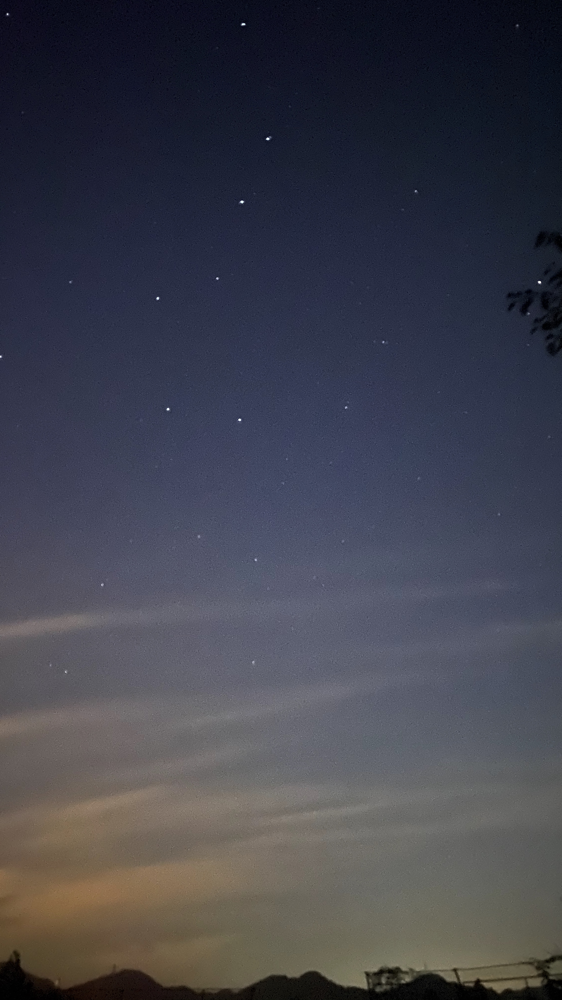

幼时的记忆已经不记得多少，还有那么一点印象就是小时候，书本上的星星真的很好看。现在想来都不知道自己有没有亲眼见过漫天繁星的夜空。

这个飞速发展的世界，为我们带来了许多，也让不少流逝。至懂事以来，晚上的夜空要不没有星星，要不零散几颗。感觉城市就是不夜城，似乎没有休息的时间。最近夜晚散步的时候拍了几张夜晚的照片。

这一张上有北斗七星哦，这还是自知道它们以来，第一次在天空中找到它们。

现在想想是不是太快的节奏连让我停下来抬头望望夜空的空闲都没有了呢？就算星星偶尔出来的夜晚我也都被我错过了。
